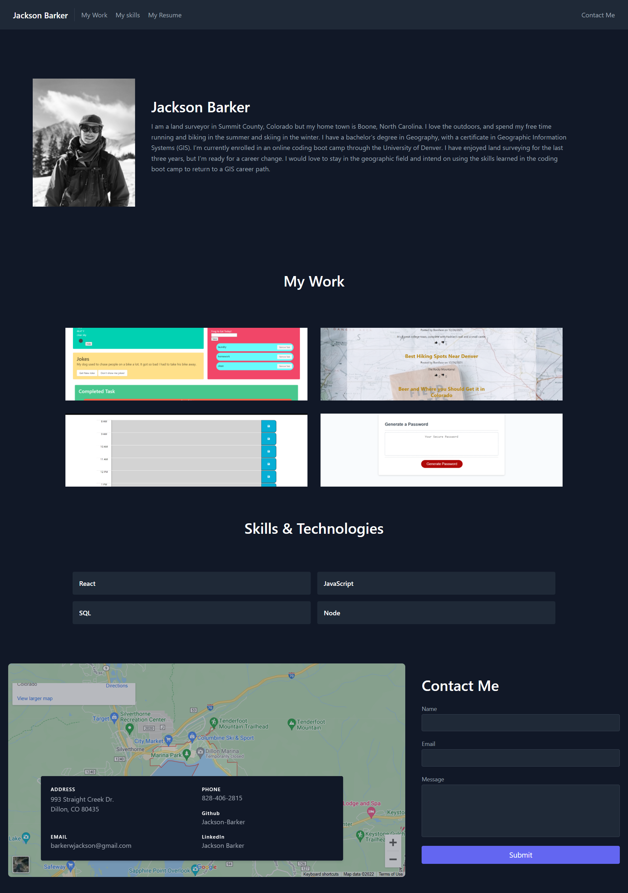

# My Portfolio
 

# Created by:

Jackson Barker

## Description
In this portfolio you will find examples of my work, my skills, resume, and contact information. You will also be able to contact me directly through a contact form.

## Usage

This portfolio is for a potential employer to view my deployed work samples to assess whether I would be a good candidate for an open position.

## Table of Contents

- [Usage](##Usage)
- [License](#license)
- [Github Profile](#github)
- [Email](#Email)
- [Screenshot](#screenshot)
- [images](#Images)

## License
MIT

## Github Profile
 
<a href="https://github.com/Jackson-Barker">GitHub Profile Link</a> 

## Email 

<a href="mailto:barkerwjackson@gmail.com">Email</a>

## Screenshot

## Images

Head Shot Image:

